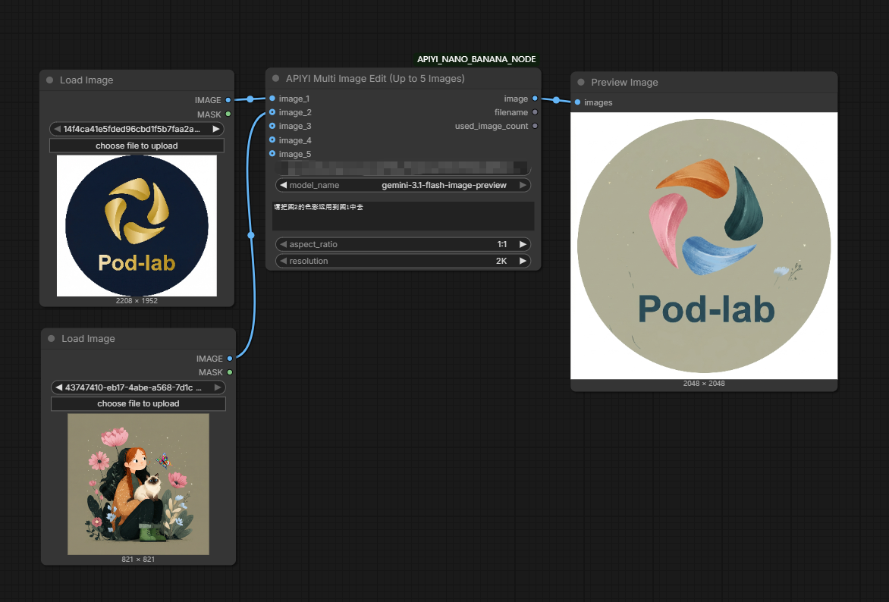

# APIYI ComfyUI 图片生成节点



这是一个 ComfyUI 自定义节点插件，提供两个节点：

1. `APIYI Text to Image`：纯提示词生图（无输入图）
2. `APIYI Multi Image Edit (Up to 5 Images)`：最多 5 张图的多图编辑/融合

支持以下能力：

- 用户手动填写 API Key
- 模型切换：
  - `gemini-3-pro-image-preview`
  - `gemini-3.1-flash-image-preview`
- 分辨率：`2K`、`4K`
- 比例选择：`1:1`、`16:9`、`9:16`、`4:3`、`3:4`、`3:2`、`2:3`、`21:9`、`5:4`、`4:5`

---

## 1. 安装方式

将整个目录放到 ComfyUI 的 `custom_nodes` 下，例如：

`ComfyUI/custom_nodes/APIYI_NANO_BANANA_NODE`

然后重启 ComfyUI。

如果你的 Python 环境没有安装依赖，请安装：

```bash
pip install requests pillow numpy
```

> 说明：`torch` 由 ComfyUI 环境通常已自带。

> 友情提示：请不要使用主密钥。建议单独创建一个专用于此节点的 API Key，并设置额度使用上限，这样更安全。

---

## 2. 节点说明

### A) APIYI Text to Image

用于文字生图，不需要输入图片。

输入参数：

- `api_key`：你的 API Key（例如 `sk-xxxx`）
- `model_name`：模型选择（两种）
- `prompt`：提示词
- `aspect_ratio`：输出比例
- `resolution`：`2K` 或 `4K`

输出：

- `image`：生成图像（ComfyUI IMAGE）
- `filename`：生成文件名字符串（仅作标识）

---

### B) APIYI Multi Image Edit (Up to 5 Images)

用于多图编辑/融合，最多支持 5 张图：

- `image_1` 必填
- `image_2` ~ `image_5` 选填

输入参数：

- `api_key`
- `model_name`
- `prompt`：编辑指令，例如“将这几张图片合成为一张专业团队照”
- `aspect_ratio`
- `resolution`
- `image_1` ... `image_5`

输出：

- `image`：生成图像
- `filename`：生成文件名字符串
- `used_image_count`：本次实际使用的输入图数量

---

## 3. 请求行为说明

- 请求地址会根据 `model_name` 自动替换：
  - `https://api.apiyi.com/v1beta/models/{model_name}:generateContent`
- 超时按分辨率自动设置：
  - `2K -> 300 秒`
  - `4K -> 360 秒`

---

## 4. 使用建议

- 文字生图：直接使用 `APIYI Text to Image`
- 多图编辑：使用 `APIYI Multi Image Edit`
- 如果你不接任何输入图，就走文字生图节点，这样结构最清晰，也避免“空图片输入”的歧义

---

## 5. 常见问题

1. **报错 API Key 不能为空**
   - 请在节点 `api_key` 中填入你的真实 key。

2. **返回状态码非 200**
   - 检查 API Key、账户权限、模型名、网络环境。

3. **多图编辑只想传 2~3 张图**
   - 只连接对应图片输入口即可，其余可留空。

---

## 6. 节点标识

- 内部类名：
  - `APIYI_Text_To_Image`
  - `APIYI_Multi_Image_Edit`
- ComfyUI 显示名：
  - `APIYI Text to Image`
  - `APIYI Multi Image Edit (Up to 5 Images)`
